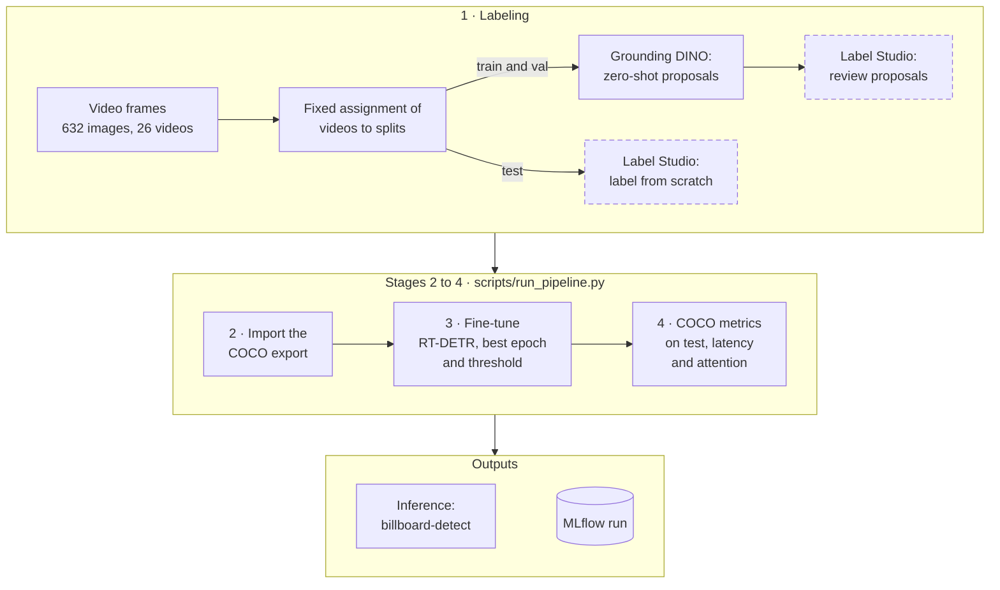

# vit-billboard-detector

[](https://github.com/ChristianConchari/vit-billboard-detector/actions/workflows/ci.yml)

Detection of **out-of-home (OOH) advertising billboards** in street-level video frames, with Transformer-based detectors. Final project for **Computer Vision III** (MIA-CEIA, FIUBA).

**Technical report (in Spanish):** [`docs/informe_tecnico.pdf`](docs/informe_tecnico.pdf).

The challenge is the data: 632 unlabeled frames and little time to annotate them. The project therefore works in two stages:

1. **Auto-labeling.** [Grounding DINO](https://arxiv.org/abs/2303.05499), an open-vocabulary detector, proposes boxes from text prompts ("billboard", "advertising sign", "ooh ad"). A human only reviews and corrects them.
2. **Fine-tuning.** [RT-DETR](https://arxiv.org/abs/2304.08069), a real-time DETR pretrained on COCO, is fine-tuned on the reviewed boxes and compared with Grounding DINO used zero-shot.


## Results

Evaluated on **95 frames from 7 videos never seen in training**, labeled by hand from scratch so that neither model influenced the ground truth.

| Model | mAP@[.5:.95] | AP50 | AP75 | Speed (RTX 4070 SUPER) |
|---|--:|--:|--:|--:|
| **RT-DETR fine-tuned** | **0.649** | **0.930** | **0.794** | **51 FPS** (19.5 ms) |
| Grounding DINO zero-shot | 0.481 | 0.723 | 0.588 | 2 FPS (471 ms) |

- **Fine-tuning wins on both accuracy and speed.** RT-DETR reaches 0.930 AP50 against 0.723 and runs at 51 FPS, fast enough for real-time video. Grounding DINO, run through the Hugging Face pipeline with one pass per prompt, is 24× slower with three prompts (about 8× with one) and is useful only offline, to pre-label data. Over 3 training seeds, RT-DETR scores 0.648 mAP (range 0.645–0.649).

  

- **More frames from the same videos stop helping after ~200 images.** RT-DETR already beats the zero-shot model with 66 training images. All images come from the same 12 training videos, so this measures redundancy between frames, not how many different scenes would be needed.

  

- **The remaining error looks like box tightness, not detection.** RT-DETR's boxes are 5–7% smaller than the hand-drawn test boxes, the same bias as the Grounding DINO pre-labels (6–9%). This is consistent with RT-DETR learning the pre-label style, since about half of its training boxes are lightly corrected pre-labels; relabeling a sample by hand would confirm it. The bias lowers mAP, which demands very tight boxes, while AP50 barely changes.

  

- **Unfreezing the ResNet-50 backbone makes no measurable difference.** It changes mAP by less than the variation between seeds ([training curves](reports/experiments/training_curves.png)).

### Examples

Green: ground truth. Red: predictions with their confidence. Left: RT-DETR; right: Grounding DINO.

| | |
|---|---|
| Several billboards: RT-DETR finds all three; Grounding DINO also marks a shop sign. |  |
| A single billboard seen from below: both models find it, RT-DETR with higher confidence. |  |
| A shared mistake: a glass facade taken for a billboard. |  |

### What the Transformer looks at


Left to right: a detection, the **encoder self-attention** from the token at the center of the billboard, and the **decoder's deformable attention**, which reads only a few points per object (dot size = weight). The decoder focuses on the billboard and its edges. Measured over the test set, the encoder pays 1.6× more attention to the *other* billboards in the frame than their share of the image would give, a sign that self-attention associates similar regions across the frame.

Full numbers: [`reports/experiments/summary.md`](reports/experiments/summary.md) (all tracked runs) and [`reports/metrics/`](reports/metrics/) (localization and attention analysis).

## How it works



1. **Labeling.** Each video is assigned to train, val or test **once, before labeling**, so near-identical consecutive frames never leak from training into evaluation. Grounding DINO proposes boxes for train and val, which are corrected in Label Studio; the test videos are labeled from scratch.
2. **Dataset.** The Label Studio export is imported and split with that fixed assignment; each split gets a content fingerprint.
3. **Training.** RT-DETR is fine-tuned for one class; the best epoch and the score threshold are chosen on validation.
4. **Evaluation.** Both models are scored with COCO metrics on the same test split; latency and attention are measured. Localization errors are analyzed separately on the final model.

One command runs steps 2 to 4 and records every run in MLflow, with the code version, the data version and all settings. Details of each component, including RT-DETR's internals, are in [`docs/architecture/`](docs/architecture/README.md).

### Experiment tracking

Every run of the pipeline is an MLflow run. The table below lists the learning-curve and ablation runs with their settings and scores; each run also stores the git commit and a fingerprint of every data split, so any number can be traced back to the exact code and data that produced it ([final model's run](reports/figures/mlflow/final_run.png)).


The [validation curves](reports/experiments/training_curves.png) show that four of the six runs with 441 training images lose validation mAP after epoch ~10; keeping the best validation epoch protects the final checkpoints from that overfitting. The [MLflow view of the ablation](reports/figures/mlflow/val_map_ablation.png) shows five of them: the sixth, frozen with seed 42, is tracked as the last point of the learning curve.

## Getting started

Tested with Python 3.12. The tests run on CPU and download no model:

```bash
python -m venv .venv && source .venv/bin/activate
pip install -e . -r requirements.txt
pytest -q
```

### Try the trained model

The final checkpoint (164 MB) is published in the
[`model-v1` release](https://github.com/ChristianConchari/vit-billboard-detector/releases/tag/model-v1).
It runs on GPU or CPU.

1. Install the project as shown above.
2. Download the weights. The script verifies the SHA-256 and unpacks them into
   `checkpoints/rtdetr-billboard/`:

   ```bash
   python scripts/download_model.py
   ```

   To do it by hand instead, download `rtdetr-billboard.zip` from the release
   and unzip it into `checkpoints/`.
3. Run the detector on an image, a folder of images or a video:

   ```bash
   billboard-detect path/to/street.jpg --checkpoint checkpoints/rtdetr-billboard --overlay-fraction 0
   billboard-detect path/to/frames/    --checkpoint checkpoints/rtdetr-billboard --overlay-fraction 0
   billboard-detect path/to/drive.mp4  --checkpoint checkpoints/rtdetr-billboard --overlay-fraction 0
   ```

Annotated copies and a `detections.json` file (boxes in pixels, `xyxy`, with
scores) are written to `outputs/detections/`. Useful options:

| Option | Default | Meaning |
|--|--|--|
| `--score-threshold` | 0.15, calibrated on validation and stored with the checkpoint | Minimum score to keep a box |
| `--overlay-fraction` | 0.08 | Bottom part of each frame to crop. The dataset cameras print a timestamp there; use `0` for other images |
| `--output-dir` | `outputs/detections` | Where to write the results |

### Reproduce the results

The dataset is private and not included. With a Label Studio export in place:

```bash
python scripts/run_pipeline.py --export-path <export>.zip
```

## Repository structure

```
configs/        model and pipeline settings (YAML)
src/vit/        library: data, models, training, evaluation, inference, pipeline
src/interfaces/ billboard-detect command-line tool
scripts/        command-line entry points (pipeline, training, evaluation, figures)
tests/          unit and end-to-end tests (run in CI)
docs/           architecture, design decisions, guides
reports/        results, figures and the exported experiment record
```

## Documentation

- [Technical report](docs/informe_tecnico.pdf) (PDF, in Spanish): objective, architecture, implementation, evaluation, results and conclusions.
- [Architecture](docs/architecture/README.md): system flow, RT-DETR internals, components.
- [Design decisions](docs/decisions/): why the provided labels were discarded, why the split is by video, why the test set was labeled from scratch.
- [Usage](docs/usage.md): the pipeline, analysis scripts, MLflow tracking, the demo.
- [Labeling workflow](docs/labeling.md): pre-labeling and review in Label Studio.
- [Development](docs/development.md): setup, code style, tests and CI.
