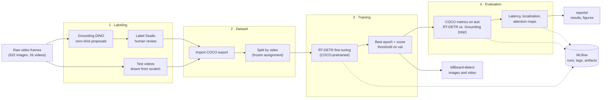
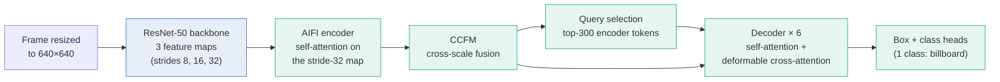

# Architecture

## System flow

Two stages, built around the scarcity of labeled images: an open-set model proposes boxes so a human only corrects them, and a real-time detector is fine-tuned on the reviewed result. Every training and evaluation run goes through one tracked pipeline.

`scripts/run_pipeline.py` runs stages 2 to 4 in one command, from a Label Studio export to `reports/runs/<run>/` and one MLflow run.

## RT-DETR inside

Blue is the backbone, frozen by default (`training.freeze_backbone`); when unfrozen it trains at a 10× lower learning rate (`training.backbone_learning_rate`). Green parts are fine-tuned. The class heads are re-initialized from 80 COCO classes to 1, with RT-DETR's focal-loss prior bias.

The attention maps in `scripts/visualize_attention.py` read the two attention types above: AIFI self-attention from the token under a detection's center, and the decoder's deformable sampling points (8 heads × 3 scales × 4 points per query).

## Components

| Component | Responsibility | Code |
|---|---|---|
| Auto-labeling | Grounding DINO proposals from several text prompts, deduplicated with class-agnostic NMS | `vit/labeling/grounding_dino_labeler.py`, `scripts/run_auto_labeling.py` |
| Label Studio sync | Push proposals as pre-annotations onto synced tasks, skipping test videos | `vit/labeling/label_studio_sync.py`, `scripts/push_predictions_to_label_studio.py` |
| Dataset | Import exports, split whole videos into train/val/test with a frozen assignment, content fingerprints | `vit/data/label_studio_export.py`, `vit/data/dataset_split.py` |
| Training data | COCO dataset with box-aware augmentations, batched through the Hugging Face image processor | `vit/data/coco_detection.py`, `vit/transforms/augmentations.py` |
| Model | Load RT-DETR with a 1-class head, freeze the backbone, initialize the head bias | `vit/models/rtdetr.py` |
| Training | AdamW with a separate backbone learning rate, cosine schedule, best-epoch checkpoint by val mAP | `vit/train/trainer.py` |
| Detectors | One `Detector` protocol for RT-DETR and Grounding DINO, so both are evaluated identically | `vit/inference/detection.py`, `vit/inference/rtdetr_detector.py`, `vit/inference/factory.py` |
| Evaluation | COCO mAP/AP50/AP75, best-F1 score threshold, latency, AP per IoU and box-edge bias | `vit/eval/coco_evaluation.py`, `vit/eval/threshold.py`, `vit/eval/latency.py`, `vit/eval/localization.py` |
| Visualization | Prediction comparisons, attention maps, learning and training curves | `vit/eval/figures.py`, `vit/eval/visualization.py`, `vit/eval/learning_curve.py`, `vit/eval/experiments.py` |
| Pipeline | One-command run with reproducibility tags in MLflow | `vit/pipeline.py`, `vit/utils/tracking.py`, `scripts/run_pipeline.py` |
| Demo | `billboard-detect` CLI for images, folders and videos | `interfaces/cli/detect.py`, `vit/inference/media.py` |

Design decisions are recorded as ADRs in [`../decisions/`](../decisions/).
