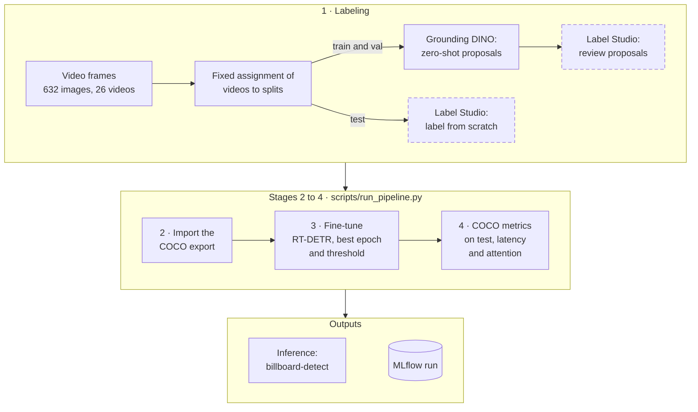
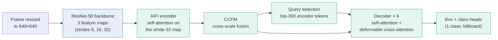

# Architecture

## System flow

An open-set model proposes boxes, a human corrects them, and a real-time detector is fine-tuned on the result.

Videos are assigned to splits once, before labeling, so the test videos are labeled without pre-labels. Dashed boxes are manual steps. The localization analysis runs separately on the final model (`scripts/analyze_localization.py`).

## RT-DETR inside

Blue: backbone, frozen or trained at a 10× lower learning rate. Green: fine-tuned. The class head goes from 80 COCO classes to 1.

The attention figures show the AIFI self-attention and the decoder's deformable sampling points.

## Components

| Component | Responsibility | Code |
|---|---|---|
| Auto-labeling | Grounding DINO proposals | `vit/labeling/grounding_dino_labeler.py`, `scripts/run_auto_labeling.py` |
| Label Studio sync | Proposals as pre-annotations, test excluded | `vit/labeling/label_studio_sync.py`, `scripts/push_predictions_to_label_studio.py` |
| Dataset | Import, split by video, fingerprints | `vit/data/label_studio_export.py`, `vit/data/dataset_split.py` |
| Training data | COCO dataset and augmentations | `vit/data/coco_detection.py`, `vit/transforms/augmentations.py` |
| Model | RT-DETR with a 1-class head | `vit/models/rtdetr.py` |
| Training | AdamW, cosine schedule, best epoch by val mAP | `vit/train/trainer.py` |
| Detectors | One interface for both models | `vit/inference/detection.py`, `vit/inference/rtdetr_detector.py`, `vit/inference/factory.py` |
| Evaluation | COCO metrics, threshold, latency, localization | `vit/eval/coco_evaluation.py`, `vit/eval/threshold.py`, `vit/eval/latency.py`, `vit/eval/localization.py` |
| Visualization | Predictions, attention, curves | `vit/eval/figures.py`, `vit/eval/visualization.py`, `vit/eval/learning_curve.py`, `vit/eval/experiments.py` |
| Pipeline | One-command tracked run | `vit/pipeline.py`, `vit/utils/tracking.py`, `scripts/run_pipeline.py` |
| Demo | `billboard-detect` CLI | `interfaces/cli/detect.py`, `vit/inference/media.py` |

Decisions: [`../decisions/`](../decisions/).
