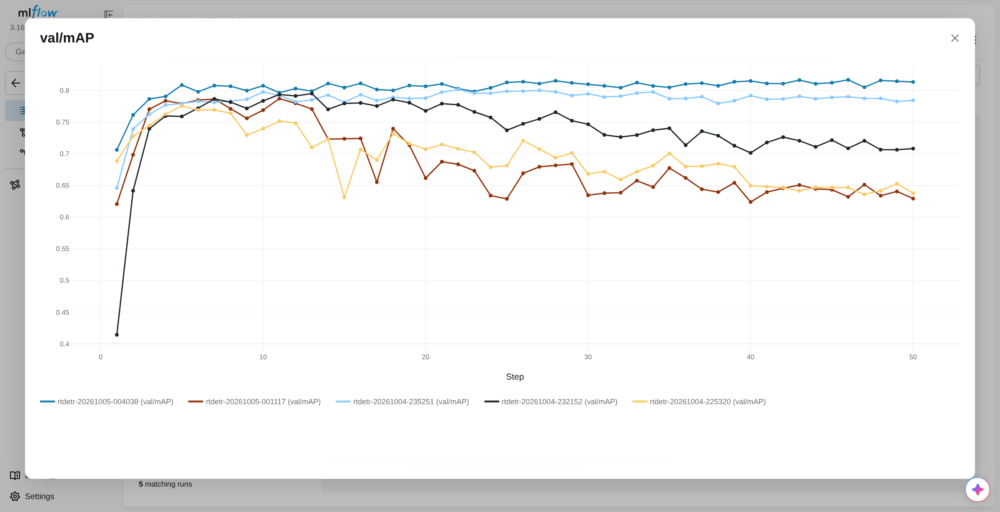
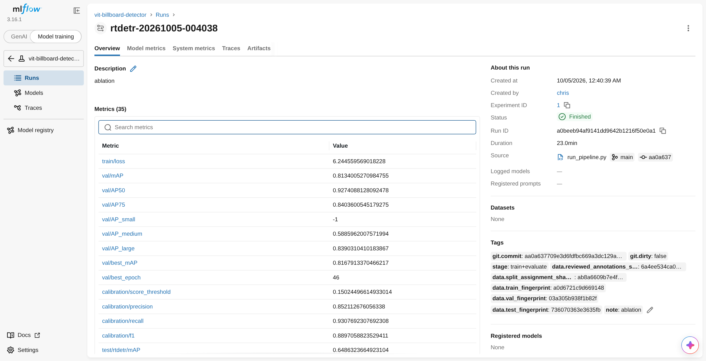

# Usage

Run every command from the repository root.

## Pipeline

```bash
python scripts/run_pipeline.py --export-path <export>.zip
```

Imports the Label Studio export, splits it by video, fine-tunes RT-DETR, calibrates the score threshold on val, evaluates RT-DETR and Grounding DINO on test, measures latency and renders figures. Results go to `reports/runs/<run>/`.

| Option | Effect |
|---|---|
| `--checkpoint <dir>` | Skip training and evaluate that checkpoint |
| `--set KEY=VALUE` | Override an RT-DETR config value, e.g. `training.seed=1` |
| `--note <text>` | Tag the run, e.g. `learning-curve` |
| `--skip-figures` | Skip the figures |

Settings live in `configs/`.

## Analysis scripts

| Script | Output |
|---|---|
| `analyze_localization.py --checkpoint <dir>` | AP per IoU threshold and box-size bias, `reports/metrics/localization_test.md` |
| `analyze_attention.py --checkpoint <dir>` | Encoder attention on other billboards, `reports/metrics/attention_test.json` |
| `visualize_predictions.py`, `visualize_attention.py` | Prediction and attention figures |
| `plot_learning_curve.py --note learning-curve` | `reports/figures/learning_curve.png` |
| `export_experiments.py` | `reports/experiments/`: runs and per-epoch metrics as CSV, ablation summary, training curves |

## Experiment tracking

Each pipeline run is one MLflow run (SQLite, `mlflow.db`):

- **tags:** `git.commit`, `git.dirty`, and a content fingerprint of each data split;
- **params:** every config value;
- **metrics:** loss and val mAP per epoch, calibration, test and latency;
- **artifacts:** the effective configs and the reports.

```bash
mlflow ui --backend-store-uri sqlite:///mlflow.db
```





## Demo

```bash
billboard-detect <image | folder | video> --checkpoint <dir>
```

| Option | Default | Meaning |
|---|---|---|
| `--score-threshold` | the checkpoint's `calibration.json` | Minimum score to keep a box |
| `--overlay-fraction` | 0.08 | Bottom part of each frame to crop (camera timestamp); `0` for other footage |
| `--output-dir` | `outputs/detections` | Output folder |

It writes annotated images, or `<name>_detections.mp4` for a video, plus `detections.json` with the boxes in pixels (`xyxy`) and their scores.
